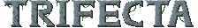

# Trifecta

A platformer game made with the Python [arcade](https://github.com/pvcraven/arcade) library for the [Python Discord Game Jam 2020](https://github.com/python-discord/game-jam-2020).

-------------------------------
About the Game
-------------------------------

Trifecta is a platformer game in which you play as a card magician battling different kinds of enemies such as, slime, skeleton, spiky ball, and a lemonade stand. Navigate levels that are randomly generated with different kinds of layouts. Defeat the lemonade stand to progress to the next level.

-------------------------------
Installing
-------------------------------

To run the game, you will need to have [Python](https://www.python.org/downloads/) installed and the Python `arcade` library. 
To install the `arcade` library: 
Type `pip install arcade` in cmd/terminal 
Download the zip file by clicking the Download button above. Unpack the zip file and open cmd/terminal inside the folder. 
Type `python -u main.py` to run the game.

-------------------------------
Instructions
-------------------------------

    A,D    to move
    W,S    to aim up/down
    D      to crouch / fall down faster
    SPACE  to jump
    SHIFT  to sprint
    J      to shoot
    K      to dash

    -,=    zoom in/out
    F10    toggle fullscreen
    ENTER  to type

-------------------------------
Screenshots
-------------------------------

 
 

